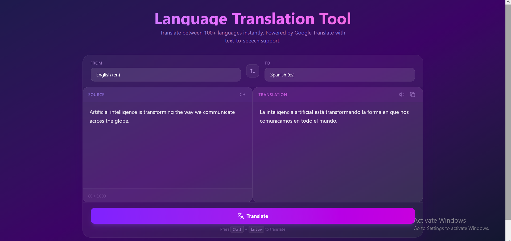

<div align="center">



# 🌐 Language Translation Tool

### *AI-Powered Real-Time Translation with Text-to-Speech*

**An NLP Translation App built with FastAPI & React.js for the CodeAlpha AI Internship**

[](https://fastapi.tiangolo.com/)
[](https://react.dev/)
[](https://tailwindcss.com/)
[](https://www.codealpha.tech/)
[](https://opensource.org/)
[](./LICENSE)

[🔨 Tech Stack](#-tech-stack) · [✨ Features](#-features) · [🚀 Getting Started](#-getting-started) · [📁 Architecture](#-project-architecture) · [📸 Screenshots](#-screenshots) · [🧑‍💻 Author](#-crafted-by)

</div>

---

## 📖 About

The **Language Translation Tool** is a production-ready, full-stack **AI Translation App** that delivers instant translations across **100+ languages** — powered by Google Translate through the `deep-translator` Python library. Designed as **Task 1** for the [CodeAlpha AI Internship](https://www.codealpha.tech/), this project demonstrates how to architect a clean FastAPI React project with a modern glassmorphism UI, real-time text-to-speech playback, and seamless language swapping.

Whether you're building an NLP translation app, exploring FastAPI backend patterns, or learning how to integrate the Web Speech API into a React frontend, this repository serves as a comprehensive, production-quality reference.

> 💡 **Zero API keys required** — the `deep-translator` library connects to Google Translate directly, so you can clone and run the project immediately.

---

## 🔨 Tech Stack

| Layer | Technology | Purpose |
|:------|:-----------|:--------|
| **Backend** |   | High-performance async API with Pydantic validation |
| **Translation Engine** |  | Google Translate integration — no API key needed |
| **Frontend** |   | Lightning-fast HMR + component-driven UI |
| **Styling** |  | Utility-first CSS with glassmorphism design system |
| **Icons** |  | Beautiful, consistent open-source icon set |
| **Text-to-Speech** |  | Browser-native TTS — no external dependencies |

---

## ✨ Features

### 🎯 Core Features

| Feature | Description |
|:--------|:------------|
| 🌍 **100+ Languages** | Dynamic language dropdowns populated from the backend — supports every language Google Translate offers |
| ⚡ **Instant Translation** | Real-time translation powered by `deep-translator` with GoogleTranslator — no API key required |
| 🔄 **Swap Languages** | One-click language swap with a smooth 180° rotation animation — text content swaps too |
| 🎨 **Glassmorphism UI** | Stunning glass-effect design with `backdrop-blur`, translucent panels, and a deep purple gradient |
| 📱 **Fully Responsive** | Split-screen on desktop, stacked on mobile — works beautifully on every screen size |

### 🚀 Bonus Features

| Feature | Description |
|:--------|:------------|
| 🔊 **Text-to-Speech** | Listen to both source and translated text via the browser's native Web Speech API with auto voice matching |
| 📋 **Copy to Clipboard** | One-click copy of the translated text with a checkmark icon confirmation that auto-resets after 2 seconds |
| ⌨️ **Ctrl + Enter Shortcut** | Press `Ctrl + Enter` (or `⌘ + Enter` on Mac) in the textarea for instant translation |
| 🔢 **Character Counter** | Live character count with color-coded warnings (amber at 4,500+, red at 5,000 limit) |
| ⚠️ **Smart Validation** | Subtle amber warning when translating empty text — no intrusive popups |
| 🔄 **Loading States** | Animated pulsing spinner with "Translating..." text during API calls |
| 🛡️ **Error Handling** | Graceful error display for network failures, same-language guards, and backend unavailability |

---

## 🚀 Getting Started

### Prerequisites

Make sure you have the following installed on your system:

- **Python 3.10+** — [Download Python](https://www.python.org/downloads/)
- **Node.js 18+** — [Download Node.js](https://nodejs.org/)
- **npm** (comes with Node.js)

### 1️⃣ Clone the Repository

```bash
git clone https://github.com/qatre-ai/language-translation-tool.git
cd language-translation-tool
```

### 2️⃣ Set Up the Backend (FastAPI)

```bash
# Navigate to the backend directory
cd backend

# Create a virtual environment (recommended)
python -m venv venv

# Activate the virtual environment
# On macOS/Linux:
source venv/bin/activate
# On Windows:
# venv\Scripts\activate

# Install Python dependencies
pip install -r requirements.txt

# Start the FastAPI server
uvicorn app.main:app --reload --host 0.0.0.0 --port 8000
```

The backend API will be available at **http://localhost:8000**

> 📖 Interactive API docs available at **http://localhost:8000/docs** (Swagger UI)

### 3️⃣ Set Up the Frontend (React + Vite)

Open a **new terminal** and run:

```bash
# Navigate to the frontend directory
cd frontend

# Install Node.js dependencies
npm install

# Start the Vite development server
npm run dev
```

The app will open at **http://localhost:5173** — the Vite dev server automatically proxies `/api/*` requests to the FastAPI backend.

### 4️⃣ Start Translating! 🎉

1. Type or paste text in the **Source** panel
2. Select your **source** and **target** languages from the dropdowns
3. Click **Translate** or press `Ctrl + Enter`
4. Use 🔊 to listen, 📋 to copy, and 🔄 to swap languages

---

## 📁 Project Architecture

```
language-translation-tool/
├── 📂 backend/                    # FastAPI Python backend
│   ├── 📄 requirements.txt        # Python dependencies
│   └── 📂 app/
│       ├── 📄 __init__.py
│       ├── 📄 main.py             # FastAPI app + CORS + health check
│       ├── 📄 models.py           # Pydantic request/response schemas
│       └── 📄 routes.py           # /api/translate + /api/languages
│
├── 📂 frontend/                   # React + Vite frontend
│   ├── 📄 index.html              # HTML shell
│   ├── 📄 vite.config.js          # Vite + Tailwind + API proxy
│   ├── 📄 package.json            # Node.js dependencies
│   └── 📂 src/
│       ├── 📄 main.jsx            # React entry point
│       ├── 📄 index.css           # Tailwind v4 import
│       ├── 📄 App.jsx             # Root layout + TTS voice preload
│       ├── 📄 App.css             # Custom animations
│       ├── 📂 components/
│       │   ├── 📄 TranslationForm.jsx   # Main orchestrator component
│       │   ├── 📄 LanguageSelector.jsx  # Dynamic language dropdown
│       │   ├── 📄 TextPanel.jsx         # Source/Target split panel
│       │   └── 📄 LoadingSpinner.jsx    # Animated loading indicator
│       └── 📂 services/
│           ├── 📄 api.js          # API service (fetch, translate, cache)
│           └── 📄 tts.js          # Web Speech API wrapper
│
└── 📄 README.md                   # You are here! ✨
```

---

## 🔌 API Endpoints

| Method | Endpoint | Description |
|:-------|:---------|:------------|
| `GET` | `/` | Health check — returns API status and version |
| `GET` | `/api/languages` | Returns all supported languages as `{code: name}` dictionary |
| `POST` | `/api/translate` | Translates text — accepts `{text, source_lang, target_lang}` |
| `GET` | `/docs` | Interactive Swagger UI documentation |
| `GET` | `/redoc` | ReDoc API documentation |

### Example API Request

```bash
curl -X POST http://localhost:8000/api/translate \
  -H "Content-Type: application/json" \
  -d '{"text": "Hello, world!", "source_lang": "en", "target_lang": "es"}'
```

### Example API Response

```json
{
  "translated_text": "¡Hola, mundo!",
  "source_lang": "en",
  "target_lang": "es",
  "original_text": "Hello, world!"
}
```

---

## 📸 Screenshots

> 🖼️ *Add your screenshots here! Replace the placeholders below with actual images.*

| Split-Screen Layout | Mobile Responsive |
|:---:|:---:|
|  |  |

| Swap Animation | Copy Confirmation |
|:---:|:---:|
|  |  |

---

## 🎨 Design System

This AI Translation Tool uses a carefully crafted **glassmorphism design system** built on Tailwind CSS v4:

| Element | Style |
|:--------|:------|
| **Background** | Deep gradient: `from-indigo-950 via-purple-950 to-slate-900` |
| **Glass Panels** | `bg-white/5 backdrop-blur-md border border-white/10` |
| **Primary Button** | Gradient: `from-violet-600 to-fuchsia-600` with glow shadow |
| **Accent Colors** | Violet → Fuchsia → Pink gradient spectrum |
| **Animations** | Custom `spin-180`, `pulse-ring`, `fade-in-up` keyframes |
| **Typography** | Gradient text headers with `bg-clip-text text-transparent` |

---

## 🤝 Contributing

Contributions, issues, and feature requests are welcome! Feel free to:

1. **Fork** the repository
2. Create a **feature branch** (`git checkout -b feature/amazing-feature`)
3. **Commit** your changes (`git commit -m 'Add amazing feature'`)
4. **Push** to the branch (`git push origin feature/amazing-feature`)
5. Open a **Pull Request**

Please make sure to update tests as appropriate and follow the existing code style.

---

## 📜 License

This project is licensed under the MIT License — see the [LICENSE](./LICENSE) file for details.

---

## 🙏 Acknowledgments

- **[CodeAlpha](https://www.codealpha.tech/)** — For the incredible AI Internship opportunity and the structured learning path that made this project possible. The internship program provides hands-on experience in AI and software engineering, and I'm grateful for the mentorship and community support.
- **[deep-translator](https://github.com/nidhaloff/deep-translator)** — For providing a free, no-API-key-required translation library that makes building NLP translation apps accessible to everyone.
- **[FastAPI](https://fastapi.tiangolo.com/)** — For the elegant, high-performance Python web framework.
- **[React](https://react.dev/)** & **[Vite](https://vite.dev/)** — For the blazing-fast frontend developer experience.
- **[Tailwind CSS](https://tailwindcss.com/)** — For making beautiful UIs achievable with utility classes.

---

<div align="center">

## 🧑‍💻 Crafted by


### **Meraj Basiri**

*AI Engineer · Open Source Enthusiast · CodeAlpha AI Intern*

[](https://github.com/merajbasiri)
[](https://linkedin.com/in/merajbasiri)
[](https://github.com/qatre-ai)

<br/>

> 💜 *If this project helped you, consider giving it a ⭐ — it means a lot!*

**[⬆ Back to Top](#-language-translation-tool)**

</div>
